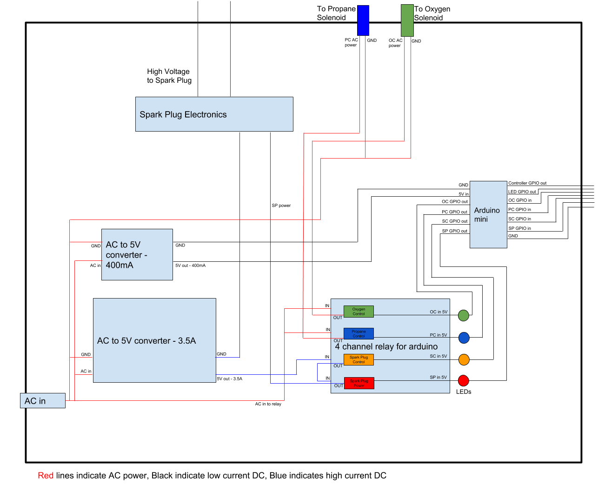

# demo-motor-control
This is the code for the demonstration hybrid propellant rocket motor to be used in the first undergraduate propulsion class at Stanford (AA 103: Air and Space Propulsion). It was built as part of the Research Experience for Undergraduates program in Aeronautics and Astronautics by Blake Hord in 2018 as a rising sophomore.

### Electronics Schematic

### Arduino Pinout
- Pin 2: oxygen button input
- Pin 3: fire button input
- Pin 4: arm button led output
- Pin 5: fire button led output
- Pin 6: propane button input
- Pin 7: UNUSED
- Pin 8: UNUSED
- Pin 9: arm button input
- Pin 10: oxygen relay output
- Pin 11: propane relay output
- Pin 12: arm relay output 
- Pin 13: fire relay output

Special thanks to Akim Cameus, David Cooper, David Dyrda, and Flora Mechentel for their help on the electronics and the rest of the motor's construction.